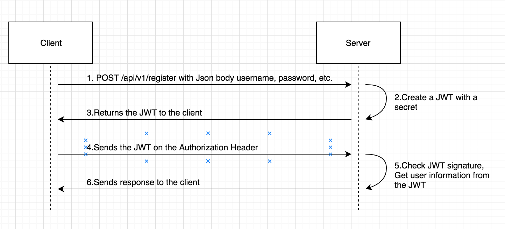

# Spring Boot With JWT


# Checking out and Building

To check out the project and build from source, do the following:

```
git clone https://github.com/backwizard/spring-boot-oauth.git

cd spring-boot-oauth

./gradlew build && java -jar build/libs/spring-boot-oauth-0.1.1.jar
```

# Usage

Registers a new user

	#+html: <p align="center"></p>

Get user detail
** replace 'header.payload.signature' with authorization after register

	(media/get.png)


# Design Concept

    (media/design.png)


